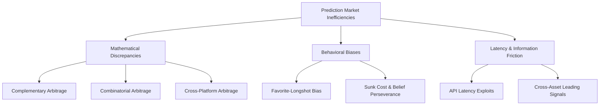
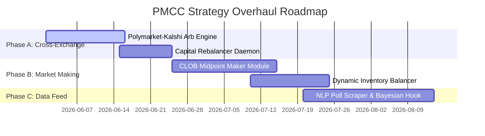

# Advanced Prediction Market Trading Strategies & Quantitative Intel

## Executive Summary

Prediction markets (such as Polymarket and Kalshi) operate fundamentally differently from traditional financial markets. Instead of trading assets valued on future discounted cash flows, they trade **binary option contracts** representing the consensus probability of real-world outcomes.

This research maps out the next generation of quantitative, statistical, and behavioral trading strategies for prediction markets. It outlines systematic market inefficiencies, mathematical pricing models, low-latency execution patterns, and provides an integration roadmap specifically designed for the **PMCC (Polymarket CLI)** codebase.

---

## 1. PMCC Strategy Register (2026-06-09)

This register records every current or queued trading strategy in PMCC. It separates shipped logic from queued experiments and research-only ideas so strategy changes can be reviewed without digging through `src/commands/smart.rs`, `src/arbitrage/mod.rs`, and `src/crypto/momentum.rs`.

Canonical docs:

- `docs/new-trading-strategies.md` is the canonical strategy register.
- `docs/strategy-result-ledger.md` is the canonical performance and disable-criteria ledger.
- `research/trading-strategy-research.md` keeps source-backed research notes and future ideas.
- `research/new-trading-strategies.md` is an index/pointer only; do not mirror this register there.

### Implemented / Active

| Strategy | Status | Entry Signal | Filters / Guards | Exit / Risk Logic | Source |
|----------|--------|--------------|------------------|-------------------|--------|
| Smart Money Multi-Wallet Convergence | Active paper-trade strategy | Multiple watched wallets converge on the same market/outcome | `min_wallets`, confidence threshold, include/exclude keywords, holder-wallet exception, price `0.05-0.95`, 14-day horizon | 10-minute confirmation queue, anti-hedge, group limit, daily cap, 24h near-resolution guard | `evaluate_triggers`, `cmd_monitor` |
| Smart Money Individual Signal Mode | Conditional active mode | Single high-confidence `NewPosition` signal | Enabled only when `min_wallets <= 1`; price `0.25-0.95`; position size >= `$200`; 14-day horizon | Same monitor queue, anti-hedge, group limit, and daily cap | `evaluate_triggers` |
| Odds Momentum Alert | Active alert strategy | Watched market odds move more than configured threshold | Include/exclude keywords; alert threshold per monitor config | Notification only by default; skipped for paper-trade queue | `odds::scan_odds`, `evaluate_triggers` |
| Confirmation Queue | Active execution guard | Any eligible non-odds trigger | 10-minute wait; cancel if whale close appears for same market/outcome; block duplicate outcome, same market hedge, and excess group exposure | Uses latest known price after queue; re-applies `0.15-0.80` paper-entry price filter | `cmd_monitor` |
| Self-Managed Smart Money Exit Manager | Active exit strategy | Open paper positions scanned on dedicated 60-second timer | Skips crypto-tagged positions; uses wallet snapshot price, CLOB midpoint fallback, and settlement quote reconciliation | Take-profit `+20%`, stop-loss `-25%`, trailing activates at `+15%` with `40%` drawdown, time-stop after 7d if ROI < `+5%` | `cmd_monitor` |
| Crypto 5m Multi-Exchange Momentum | Active experimental paper-trade strategy | BTC/ETH momentum direction from spot + futures data | 60-second loop; 08:00-20:00 ET only; min confidence default `0.6`; max 6 trades/hour; max `$60`/day; duplicate market guard | Fixed paper entry `0.50`; tiered sizing: base `$5`, `1.5x` at `>=0.65`, `2x` at `>=0.75`; resolves expired 5m markets | `cmd_crypto_monitor`, `compute_signal_full` |
| Binary Complement Arbitrage Scanner | Implemented scanner | Active binary market where YES best ask + NO best ask < `1.00` | Active/closed=false markets, two CLOB token IDs, ordered by volume | Scanner only; reports guaranteed margin, no auto-execution | `scan_complement_arbitrage` |
| Favorite-Longshot Bias Scanner | Implemented scanner | Active market token priced in favorite or longshot bands | Favorites `0.80-0.95`; longshots `0.01-0.05`; ordered by volume | Scanner only; reports candidates, no auto-execution | `scan_favorite_longshot_bias` |

### Strategy Queue / Needs Update

| Priority | Strategy | Action Needed | Notes |
|----------|----------|---------------|-------|
| P0 | Current sample accumulation and second refresh | Let Smart Money reach a meaningful current sample, then re-run ledger refresh commands | 2026-06-09 refresh found only 8 Smart Money closed trades and no crypto paper trades; do not build more entry logic from that sample. |
| P1 | CLOB midpoint as crypto 8th signal component | Add CLOB midpoint agreement/disagreement filter before crypto paper entry only if current crypto ledger still shows weak but salvageable edge | Intended to reduce noisy 5m momentum trades. If CLOB disagrees with direction, skip; if aligned, confidence boost. |
| P1 | Whale-exit-as-entry fade experiment | Add separate paper-only trigger/tag `fade-whale-exit` only after current Smart Money ledger supports another entry experiment | Current whale exits are logged only. Experiment should enter after whale loss/panic exit and track separately. |
| P1 | Backtest Sprint 13 rules | Export paper trades and backtest Smart Money exit rules plus crypto filters | Current todo already includes C.1-C.4. Keep results linked from the ledger. |
| P2 | Cross-Platform Arbitrage | Build Polymarket-Kalshi matching and capital model | Research-only until market mapping and fees are handled. |
| P2 | CLOB Market Maker | Prototype inventory-aware quoting | Research-only; requires order placement safety, inventory limits, and cancellation logic. |
| P2 | Bayesian Polls / Sentiment Pipeline | Define source ingestion, posterior model, and execution threshold | Research-only; needs source reliability scoring and latency tests. |
| P2 | Combinatorial Arbitrage | Extend arbitrage scanner to multi-outcome exhaustive markets | Needs market grouping and all-outcome CLOB book coverage. |
| P3 | Time-Decay / Vol-Squeeze | Define event calendar, implied-vol proxy, and exit timing | Research-only; dangerous without event schedule and liquidity checks. |

---

## 2. Systemic Market Inefficiencies & Quantitative Edge

Successful quantitative trading in prediction markets relies not on "knowing the future," but on exploiting structural market flaws, mathematical discrepancies, and behavioral biases.



### A. Mathematical Arbitrage Strategies

#### 1. Binary Complement Arbitrage
In a simple two-outcome market (YES/NO), the mathematical sum of the probabilities must equal $1.00 ($100%). However, due to order book fragmentation, bid-ask spreads, and sudden liquidations, the sum of the best ask prices frequently dips below $1.00.
$$\text{Sum} = P(\text{YES}) + P(\text{NO}) < 1.00$$
*   **Edge:** If $\text{Sum} = 0.97$, buying equal units of YES and NO guarantees a risk-free return of $\approx 3.09\%$, regardless of the resolution outcome.

#### 2. Combinatorial Arbitrage
For mutually exclusive and exhaustive multi-outcome markets (e.g., "Which party wins the 2028 US Election?"), the sum of all outcomes must equal $1.00.
$$\sum_{i=1}^{n} P(\text{Outcome}_i) \neq 1.00$$
*   **Under-pricing (Arbitrage):** If the sum of the lowest ask prices of all outcomes is $< 1.00$, a trader can buy all outcomes and guarantee a profit.
*   **Over-pricing (Synthetic Shorts):** If the sum of the highest bids is $> 1.00$, a trader cannot easily short-sell all outcomes unless they buy $n-1$ outcomes to synthetically short the remaining one.

#### 3. Cross-Platform Arbitrage
Capitalizes on pricing disparities between platforms (e.g., Polymarket vs. Kalshi vs. PredictIt).
*   **Example:** If Polymarket prices "Fed Cuts Rates in June" at $0.45$ (YES) and Kalshi prices it at $0.52$ (YES), a trader can buy YES on Polymarket ($0.45$) and NO on Kalshi ($0.48$), locking in a guaranteed profit upon settlement.
*   **Constraints:** Requires managing capital requirements across multiple platforms and accounting for exchange-specific fees and withdrawal lags.

---

### B. Behavioral Bias Strategies

#### 1. The Favorite-Longshot Bias (FLB)
A universal bias observed in sports betting and prediction markets: traders systematically overvalue low-probability outcomes (longshots) and undervalue high-probability outcomes (favorites).
*   **Mechanism:** People are naturally risk-seeking with small amounts of money when there is a chance for a massive payout (e.g., buying a contract at $0.02 for a potential 50x return).
*   **Quantitative Edge (Systematic Fading):**
    *   **Buy Favorites:** Buy contracts priced in the $0.80 - $0.95 range.
    *   **Sell Longshots:** Provide liquidity on the NO side of extremely low-probability events (priced at $0.01 - $0.05).

#### 2. Sunk Cost & Belief Perseverance
Retail traders often refuse to cut losses on political or ideological markets because they are emotionally invested. This leads to sticky pricing where contracts fail to adapt to new, high-quality data.
*   **Quantitative Edge:** When highly reliable polling aggregators (e.g., 538, Silver Bulletin) update their projections, prices on Polymarket often lag by hours or days. Algorithmic sentiment/data scrapers can trade the gap before the retail crowd adjusts.

---

## 3. Advanced Predictive Modeling & Market Analysis

```
       BAYESIAN UPDATING FLOW FOR LIVE EVENTS

  [ Prior Probability: P(H) ] ---> [ Live Poll Data: P(E|H) ]
                                            |
                                            v
  [ Market Price Adjusts    ] <--- [ Posterior: P(H|E)      ]
```

### A. Bayesian Updating Models
Instead of guessing, traders can utilize Bayesian probability updating to dynamically evaluate incoming information.
$$P(H|E) = \frac{P(E|H) \cdot P(H)}{P(E)}$$
Where:
*   $P(H|E)$ is the **posterior probability** of the event occurring given the new data $E$ (e.g., a new swing state poll).
*   $P(H)$ is the **prior probability** (current market price or historical baseline).
*   $P(E|H)$ is the likelihood of seeing this data $E$ if the hypothesis $H$ is true.

By calculating $P(H|E)$ instantaneously when polling data drops, a bot can determine if the market is under- or over-reacting.

### B. Time-Decay Option Curves (Theta-Like Modeling)
Prediction contracts behave like zero-days-to-expiry (0DTE) options. As the resolution date approaches, the price of the winning contract rapidly converges to $1.00, while the losers crash to $0.00.
*   **Implied Volatility (IV):** High price dispersion in the days leading to resolution creates massive swings.
*   **Vol-Squeeze Strategy:** Shorting options (selling bids) when IV is unsustainably high prior to major scheduled announcements (e.g., CPI releases, earnings, court rulings), and closing the position immediately post-announcement as volatility collapses.

---

## 4. Integration Roadmap for PMCC

To leverage these strategies, we propose expanding the current **PMCC** system to include automated quantitative modules.



### Proposed Action Items & Architecture

#### 1. Polymarket-Kalshi Arbitrage Engine (Phase A)
*   **Objective:** Continuously scan matching contracts on Polymarket and Kalshi for price disparities.
*   **Design:**
    *   Create a new module `src/arbitrage/mod.rs` and `src/arbitrage/kalshi.rs`.
    *   Utilize a WebSocket feed to listen to both exchanges.
    *   Trigger automated orders when the combined contract price drops below $0.98.
```rust
// Proposed structural sketch in PMCC
pub struct ArbOpportunity {
    pub polymarket_condition_id: String,
    pub kalshi_ticker: String,
    pub poly_ask: Decimal,
    pub kalshi_ask: Decimal,
    pub profit_margin: Decimal,
}
```

#### 2. CLOB Market Maker (Phase B)
*   **Objective:** Capture the bid-ask spread on highly liquid markets using dynamic limit orders.
*   **Design:**
    *   Implement an inventory-hedging market-making algorithm (similar to Avellaneda-Stoikov).
    *   Adjust spreads based on token inventory to avoid being overexposed to a single direction.
    *   Use Polymarket's `OrderType::FOK` or limit order books to continuously quote inside the spread.

#### 3. Bayesian Polls-Sentiment Pipeline (Phase C)
*   **Objective:** Automatically digest new political or macroeconomic reports and trade the immediate probability changes.
*   **Design:**
    *   Write a background scraper daemon that monitors RSS feeds, Twitter/X APIs, and FiveThirtyEight poll drops.
    *   Compute the Bayesian posterior probability $P(H|E)$ immediately upon receipt of new data.
    *   Place orders if the calculated probability differs from the Polymarket price by $> 5\%$.

---

## Conclusion
By shifting focus from speculative prediction to systematic execution—specifically targeting complementary arbitrage, favorite-longshot biases, and cross-platform discrepancies—PMCC can move from a simple smart-money follower to a high-performance quantitative predictive trading platform.
