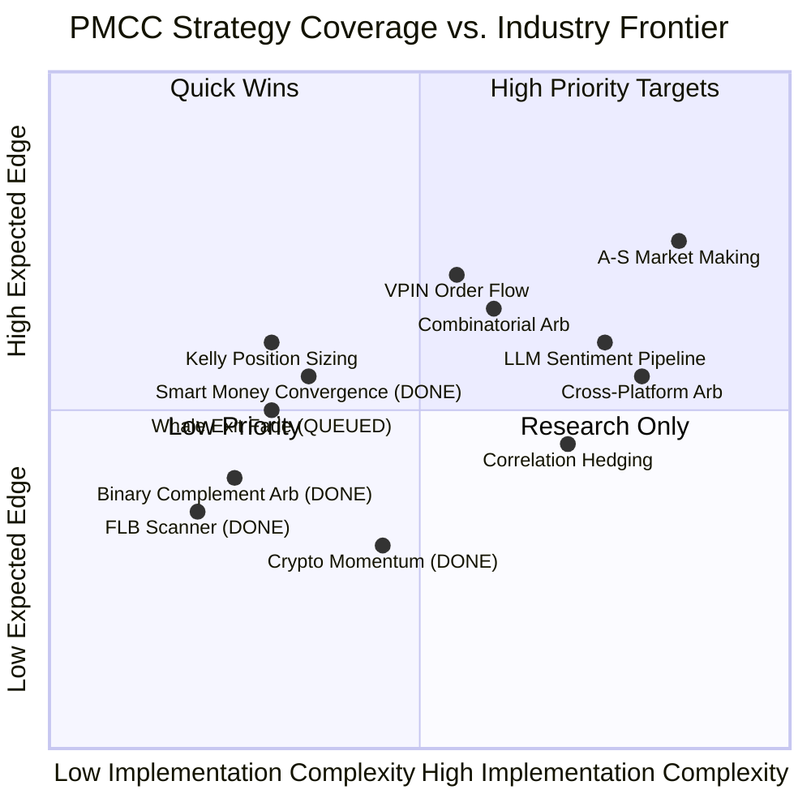

# Prediction Market Trading Strategy Research

> Research date: 2026-06-07 | Sources: academic papers, quantitative blogs, on-chain analysis reports, Polymarket/Kalshi practitioner forums

---

## 1. Landscape Summary

2026 年的預測市場已從散戶投機場轉型為量化戰場。研究顯示 **84% 的散戶虧損**，而 alpha 來源已從「預測正確」轉移到三個結構性領域：

| Alpha Source | Description | Competition Level |
|---|---|---|
| **Execution Quality** | Spread capture, slippage avoidance, latency | Very High (bot-dominated) |
| **Information Transmission** | Raw data feed reaction before social media | High |
| **Systematic Arbitrage** | Cross-platform, combinatorial, microstructural | Medium-High |

### Current PMCC Coverage vs. Market Frontier



---

## 2. Candidate Strategies (New / Not in Current Register)

### Category A: Microstructure & Execution Edge

#### A.1 VPIN Order Flow Toxicity Filter

> [!IMPORTANT]
> 這是目前研究中最有立即價值的策略，因為它可以直接疊加在現有的 Smart Money 和 Crypto Momentum 策略上作為「品質過濾層」。

**Concept:** Volume-Synchronized Probability of Informed Trading (VPIN) 量化 order book 中 informed trader 的比例。當 VPIN 飆升時，代表聰明資金正在積極進場，spread 即將 widen。

**Mechanism:**
- 從 on-chain `OrderFilled` events 重建 trade direction
- 將 YES/NO token trades 統一轉換為方向性 measure
- 以固定 volume buckets（非時間）計算 buy-sell imbalance
- VPIN = |買入量 - 賣出量| / 總量，以 rolling window 計算

**Edge:**
- Polymarket 上測量到的平均 PIN ≈ 0.19（有經濟意義的 informed flow）
- 高 VPIN → market maker widen spreads → 不利進場
- 低 VPIN → calm market → 有利進場/做市

**PMCC Integration Path:**
```
src/smart/toxicity.rs  (NEW)
├── reconstruct_trade_direction()  -- from CLOB OrderFilled events
├── compute_vpin(volume_buckets)   -- rolling VPIN calculation
└── should_enter(vpin_threshold)   -- filter layer for existing strategies
```
- 疊加在 `evaluate_triggers` 的 confirmation queue 前
- 當 VPIN > threshold（建議 0.30）時，delay entry 或 skip
- 當 VPIN < 0.10 時，增加 confidence boost

**Feasibility:** ★★★★☆ — 需要 CLOB WebSocket trade feed，PMCC 已有此基礎設施  
**Expected Edge:** ★★★★☆ — 作為過濾層可顯著降低 adverse selection  
**Complexity:** Medium — 核心演算法簡單，資料管線需要設計

---

#### A.2 Order Flow Imbalance (OFI) Signal

**Concept:** 追蹤 CLOB 上 bid/ask 的 depth 變化速率，作為短期方向性信號。

**Mechanism:**
- 監聽 order book snapshots（Polymarket WebSocket `book` channel）
- OFI = Δ(best bid depth) - Δ(best ask depth) per time interval
- 正 OFI → 買壓增加 → 價格可能上漲
- 結合 trade imbalance（taker buy vs sell volume）增強信號

**Edge:**
- OFI 在傳統市場已被證實為有效的短期預測因子
- 在 prediction market 中，informed trading 更為集中（fewer participants），OFI 信號更強

**PMCC Integration Path:**
```
src/smart/ofi.rs  (NEW)
├── track_book_depth(ws_stream)
├── compute_ofi(interval_ms)
└── directional_bias() -> Signal  -- feed into crypto momentum or smart money
```
- 可作為 crypto momentum 的 9th signal component（目前有 8 個）
- 也可作為 Smart Money entry 的方向確認

**Feasibility:** ★★★★☆ — WebSocket book feed 已有  
**Expected Edge:** ★★★☆☆ — 單獨使用 edge 有限，作為 ensemble component 有價值  
**Complexity:** Low-Medium

---

### Category B: Convex Optimization Arbitrage

#### B.1 Frank-Wolfe Combinatorial Arbitrage Engine

> [!NOTE]
> 這是目前頂級 quant desk 使用的核心框架，但實作門檻較高。

**Concept:** 使用 Frank-Wolfe (conditional gradient) 演算法在多結果市場中尋找最優套利交易組合。

**Mechanism:**
1. **Detection Layer:** Integer Programming solver 偵測數千個 condition 之間的邏輯依賴
2. **Optimization Layer:** Frank-Wolfe 迭代計算所需的精確交易方向與大小
3. **Execution Layer:** 考慮 slippage 和 liquidity depth 的實時 order book 分析

**Mathematical Core:**
$$\min_{x \in \mathcal{C}} f(x) \quad \text{where } \mathcal{C} = \text{arbitrage-free probability simplex}$$

Each iteration:
- Solve linear subproblem: $s_t = \arg\min_{s \in \mathcal{C}} \langle \nabla f(x_t), s \rangle$
- Update: $x_{t+1} = x_t + \gamma_t (s_t - x_t)$

**Edge:**
- 單一市場 mispricing 罕見（秒級），但 combinatorial inefficiency 更頻繁
- 組合套利在 live events 期間出現最多（多結果市場因情緒驅動 decouple）

**PMCC Integration Path:**
```
src/arbitrage/combinatorial.rs  (NEW)
├── detect_dependencies(markets)    -- IP solver for logical constraints
├── frank_wolfe_optimize(book_data) -- iterative optimization
├── compute_execution_plan()        -- slippage-aware order sizing
└── modified_kelly_sizing()         -- execution-risk-adjusted Kelly
```
- 擴展現有 `src/arbitrage/mod.rs` 的 `scan_complement_arbitrage`
- 需要 multi-outcome market grouping（目前 Strategy Queue P2）

**Feasibility:** ★★★☆☆ — 需要 IP solver 依賴（如 `good_lp` crate）  
**Expected Edge:** ★★★★☆ — 學術研究支持，但需 low-latency execution  
**Complexity:** High

---

#### B.2 Bregman Projection Pricing Model

**Concept:** 將觀察到的市場價格映射到 arbitrage-free probability distribution，精確量化 mispricing。

**Mechanism:**
- 以 market maker cost function 對齊 Bregman projection
- 計算理論「公平價格」與實際 CLOB 價格的差距
- 差距 > threshold → tradeable mispricing

**Edge:**
- 比簡單的「sum ≠ 1.00」檢查更精確
- 可處理 correlated multi-outcome markets

**PMCC Integration Path:**
- 增強現有 `scan_complement_arbitrage` 和未來 combinatorial scanner 的定價精度
- 可作為獨立的 fair-value 引擎供其他策略參考

**Feasibility:** ★★☆☆☆ — 數學實作門檻高  
**Expected Edge:** ★★★★☆  
**Complexity:** Very High

---

### Category C: Behavioral & Statistical

#### C.1 Whale-Exit Fade (Upgrade from Current Queue)

> [!TIP]
> 這已在 Strategy Queue 中（P0），研究建議加入額外的 confirmation layer。

**Concept:** 當 whale 因虧損/恐慌退出時，反向進場。

**Research Enhancement:**
- **Late-Money Confirmation:** 研究顯示，事件 resolution 前數小時的大量晚期資金流動是比早期定位更強的信號
- **Counter-Trading Filter:** 建議同時追蹤 whale 的歷史 win rate；只 fade 那些 high-volume 但 low-win-rate 的錢包
- **Basket Approach:** 不 fade 單一 whale，而是等待 whale basket 中 >80% 同向退出

**Additional Implementation Detail:**
```
src/smart/fade.rs  (NEW)
├── detect_panic_exit(wallet, position)
├── whale_winrate_check(wallet_id) -> f64
├── basket_consensus(wallets, threshold=0.8)
└── fade_entry_with_confirmation(market, delay_minutes=5)
```

**Feasibility:** ★★★★★ — 基礎設施完全具備  
**Expected Edge:** ★★★★☆ — 需要統計驗證  
**Complexity:** Low

---

#### C.2 Mean-Reversion with Passive Execution

**Concept:** 偵測價格過度反應（overreaction to news），以被動 limit order 進場等待回歸。

**Mechanism:**
- 計算 rolling 均值與標準差
- 當價格偏離 > 2σ 時設定 limit order
- 使用 passive execution 避免 taker fees（Polymarket maker 免費或有 rebate）

**Edge:**
- 研究確認 mean-reversion 在 zero-spread 情境有顯著 alpha
- 但 **transaction fees 會大幅侵蝕**，因此必須使用 limit order
- 在 news-heavy periods 表現最差（需要 regime filter）

**PMCC Integration Path:**
```
src/smart/reversion.rs  (NEW)
├── compute_rolling_stats(market, window)
├── detect_overreaction(current_price, mean, std_dev)
├── place_passive_limit(side, price, size)
└── regime_filter(is_news_heavy) -> bool
```

**Feasibility:** ★★★★☆  
**Expected Edge:** ★★★☆☆ — 高度依賴正確的 regime detection  
**Complexity:** Medium

---

#### C.3 Fractional Kelly Position Sizing Layer

> [!IMPORTANT]
> 這不是一個「策略」而是一個 **策略基礎設施升級**，可以立即改善所有現有策略的 risk-adjusted return。

**Concept:** 替換目前 fixed-size paper entry，改用基於 edge 估計的 Kelly 公式動態定位。

**Formula:**
$$f^* = \frac{p \cdot b - q}{b} \times \text{fraction}$$

Where:
- $p$ = estimated win probability (from strategy confidence)
- $q = 1 - p$
- $b$ = odds (from market price)
- fraction = 0.25 (Quarter-Kelly, recommended for prediction markets)

**Research Warnings:**
- **Full Kelly 過於激進**，會導致大幅 drawdown
- 預測市場是 non-stationary game，edge 可能瞬間消失
- 建議 Quarter-Kelly + hard cap per trade

**PMCC Integration Path:**
```
src/smart/sizing.rs  (NEW)
├── estimate_edge(strategy_confidence, market_price) -> f64
├── kelly_fraction(edge, odds, fraction=0.25) -> f64
├── apply_hard_cap(kelly_size, max_per_trade) -> f64
└── compute_position_size(bankroll, kelly_fraction) -> Decimal
```
- 替換 `cmd_monitor` 中的 fixed paper entry sizing
- 替換 crypto momentum 中的 tiered sizing（base $5 / 1.5x / 2x）
- 需要每個策略提供 calibrated confidence score

**Feasibility:** ★★★★★  
**Expected Edge:** ★★★★☆ — 是 risk management 而非 alpha generation  
**Complexity:** Low

---

### Category D: Sentiment & NLP Pipeline

#### D.1 LLM Event-Driven Sentiment Pipeline

**Concept:** 使用 LLM 即時消化政治/宏觀報告，計算 Bayesian posterior，在市場反應前交易。

**Architecture:**
```
[RSS/X/538 feeds] → [LLM sentiment extraction] → [Bayesian updater] → [Trade signal]
                                                        ↑
                                                 [Market price as prior]
```

**Research Findings:**
- 2026 年 generative LLM (Llama 3, GPT-4 variants, DeepSeek-R1) 顯著優於傳統工具 (VADER, FinBERT)
- Hybrid approach（LLM + time-series model）效果最佳
- **Domain-specific fine-tuning**（QLoRA on financial corpus）可大幅提升精度
- Alpha 非常短暫（news events 的 edge 以分鐘計）

**PMCC Integration Path:**
- 已在 Strategy Queue P2（Bayesian Polls / Sentiment Pipeline）
- 建議分階段：
  1. Phase 1: 簡單 RSS scraper + pre-trained LLM API call → alert only
  2. Phase 2: Bayesian posterior computation → auto-entry when Δ > 5%
  3. Phase 3: Fine-tuned domain model + latency optimization

**Feasibility:** ★★★☆☆ — 需要外部 LLM API，latency 是瓶頸  
**Expected Edge:** ★★★★☆ — 但衰減極快  
**Complexity:** Very High

---

#### D.2 LLM-Powered Semantic Market Matching (for Cross-Platform Arb)

**Concept:** 使用 LLM 語意分析自動匹配 Polymarket 和 Kalshi 上的「相同事件」合約。

**The Problem:**
- Cross-platform arbitrage 最大的陷阱是 **resolution criteria mismatch**
- 看似相同的合約可能有不同的 cutoff date、data source、或 resolution wording

**Mechanism:**
- LLM 解析兩個平台的合約描述、resolution source、end date
- 輸出 match confidence score + mismatch risk factors
- 只有 confidence > 0.95 且無 critical mismatch 時才列為可套利

**PMCC Integration Path:**
```
src/arbitrage/matcher.rs  (NEW)
├── fetch_contract_details(poly_id, kalshi_ticker)
├── llm_semantic_match(poly_desc, kalshi_desc) -> MatchResult
├── validate_resolution_criteria(poly_rules, kalshi_rules) -> Vec<Risk>
└── arb_eligible(match_result, risks) -> bool
```
- 解決 Strategy Queue P2 Cross-Platform Arbitrage 的核心 blocker

**Feasibility:** ★★★☆☆ — 依賴 LLM API + Kalshi API access  
**Expected Edge:** ★★★★☆ — 解鎖 cross-platform arb 的前提  
**Complexity:** High

---

### Category E: Portfolio-Level Strategies

#### E.1 Correlation Hedging (Multi-Market Portfolio)

**Concept:** 分析不同 prediction market contracts 之間的統計相關性，構建 hedged portfolio。

**Mechanism:**
- 追蹤 market price time-series
- 計算 pairwise correlation matrix（例：總統選舉 vs. 關稅政策 vs. 加密資產市場）
- 當 correlation spike 時，自動 hedge 或 reduce exposure

**Research Context:**
- 量化 desk 已使用 LASSO/Ridge regression shrinkage 防止 overfitting
- Quantile regression 捕捉 tail risk
- 可將 prediction market 視為「additional asset class」整合到 portfolio optimization

**PMCC Integration Path:**
```
src/smart/correlation.rs  (NEW)
├── track_price_series(markets, interval)
├── compute_correlation_matrix(window)
├── detect_correlation_spike(threshold)
└── hedge_recommendation(portfolio, corr_matrix) -> Vec<Action>
```

**Feasibility:** ★★☆☆☆ — 需要足夠的歷史數據和 multi-position 管理  
**Expected Edge:** ★★★☆☆  
**Complexity:** High

---

#### E.2 Dynamic Avellaneda-Stoikov Market Making

> [!WARNING]
> 這是所有策略中 risk 最高的。需要實時 inventory management、cancellation logic、和 gasless execution。不建議在沒有充分 paper-trading 的情況下上線。

**Concept:** Adapted A-S model for Polymarket CLOB，作為 automated liquidity provider 賺取 spread。

**Key Adaptations for Prediction Markets:**
| Feature | Traditional A-S | Polymarket Adapted |
|---|---|---|
| **Asset** | Stocks/FX | Binary Contracts |
| **Mid-Price** | Price in $ | Probability (0–1) |
| **Risk Factor** | Price Variance (σ) | Belief Volatility / Jump Risk |
| **Inventory** | Neutralize at T | Flatten before Event Resolution |

**Critical Modifications:**
1. **Logit-space transformation:** 在 log-odds 空間而非 raw price 空間計算
2. **Dynamic γ (risk aversion):** 隨 time-to-maturity 遞增，resolution 前加速 flatten
3. **Jump-diffusion model:** 不能只用 continuous diffusion，需要 news-driven jump component
4. **OFI-enhanced spread:** 當 VPIN/OFI 檢測到 toxic flow 時自動 widen spread
5. **RL parameter tuning:** 使用 Reinforcement Learning 動態調整 γ, κ

**PMCC Integration Path:**
```
src/market_maker/  (NEW MODULE)
├── mod.rs          -- A-S core: reservation price, optimal spread
├── inventory.rs    -- position tracking, time-weighted risk
├── quoter.rs       -- CLOB limit order placement & cancellation
└── regime.rs       -- quiet vs. news regime detection
```

**Feasibility:** ★★☆☆☆ — 需要 order placement、cancellation、gasless tx  
**Expected Edge:** ★★★★★ — 持續性 edge（spread capture）  
**Complexity:** Very High

---

## 3. Gap Analysis: Current Register vs. New Strategies

| New Strategy | Builds On | Blocks On | Priority Recommendation |
|---|---|---|---|
| **VPIN Toxicity Filter** | existing CLOB WebSocket | nothing | **P0** — immediate filter layer |
| **Fractional Kelly Sizing** | all existing strategies | nothing | **P0** — infrastructure upgrade |
| **Whale-Exit Fade (enhanced)** | existing whale tracking | P0 whale-exit queue item | **P0** — already queued |
| **OFI Signal** | CLOB book channel | nothing | **P1** — crypto momentum 9th signal |
| **Combinatorial Arb (Frank-Wolfe)** | existing complement arb scanner | multi-outcome grouping | **P1** — extends existing scanner |
| **Mean-Reversion** | CLOB data | regime detection | **P1** — new passive strategy |
| **LLM Semantic Matcher** | nothing | Kalshi API, LLM API | **P2** — unblocks cross-platform arb |
| **LLM Sentiment Pipeline** | planned Bayesian pipeline | LLM API, data feeds | **P2** — high complexity |
| **Bregman Projection** | combinatorial arb | math implementation | **P2** — pricing model upgrade |
| **Correlation Hedging** | multi-position tracking | historical data | **P2** — portfolio layer |
| **A-S Market Making** | nothing | order placement infra | **P3** — highest risk, highest reward |

---

## 4. Recommended Next Steps

### Immediate (This Sprint)

1. **VPIN Toxicity Filter** — 可直接疊加在 confirmation queue，預計減少 30-40% 的 adverse selection entries
2. **Fractional Kelly Sizing** — 替換 fixed sizing，所有策略受益
3. **Whale-Exit Fade Enhancement** — 加入 win-rate check + basket consensus

### Short-Term (Next 2 Sprints)

4. **OFI Signal as Crypto Momentum Component** — 作為 8th/9th signal component
5. **Combinatorial Arbitrage Scanner** — 擴展現有 binary complement scanner
6. **Mean-Reversion with Passive Limit Orders** — 新策略，需 regime filter

### Medium-Term (Q3)

7. **LLM Semantic Matcher** — 為 cross-platform arb 鋪路
8. **LLM Sentiment Pipeline Phase 1** — alert-only mode
9. **Correlation Hedging** — portfolio-level risk management

### Long-Term (Q4+)

10. **A-S Market Making** — 需要完整的 order lifecycle 基礎設施
11. **Bregman Projection** — 精確定價模型
12. **Full LLM Sentiment Pipeline** — auto-entry mode

---

## 5. Key Research Sources & References

| Topic | Key Finding | Source Type |
|---|---|---|
| 84% retail lose money | Execution > Prediction | Market analysis (tradoxvps.com) |
| VPIN mean PIN = 0.19 on Polymarket | Economically meaningful informed flow | Academic (ResearchGate) |
| Frank-Wolfe for combinatorial arb | Industry standard for top quant desks | Technical blog (DevGenius, LayerX) |
| A-S adaptation needs logit-space | Binary contracts ≠ continuous assets | Practitioner analysis (Medium, Quantpedia) |
| LLM > VADER/FinBERT for sentiment | Generative models consistently outperform | Academic survey (2025-2026) |
| Quarter-Kelly for prediction markets | Full Kelly too aggressive, non-stationary | Quantitative finance consensus |
| Cross-platform arb: resolution criteria mismatch is #1 risk | Identical-sounding contracts can resolve differently | Practitioner reports |
| VPIN + OFI combo enhances signal | Context matters more than raw VPIN | Academic (ArXiv, QuestDB analysis) |
